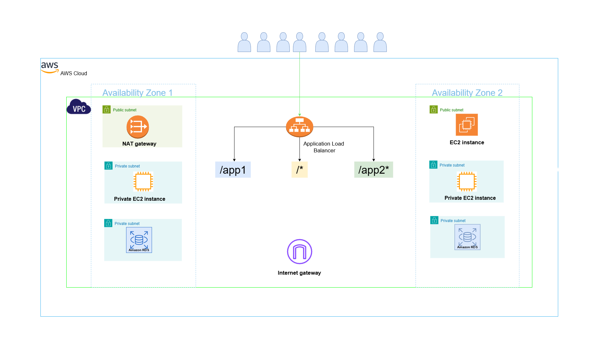

# 🌩️ AWS Application Load Balancer (ALB) Infrastructure using Terraform
## 🧠 Overview

This project demonstrates how to design, automate, and deploy a highly available and secure AWS infrastructure using Terraform.
It provisions a full multi-tier architecture consisting of networking (VPC), compute (EC2), database (RDS), and load balancing (ALB) — all defined through Infrastructure as Code (IaC).

The goal is to simulate a real-world production environment where:
- Traffic is routed through an Application Load Balancer
- Applications run inside private subnets
- A bastion host provides controlled SSH access
- A managed RDS MySQL database handles backend storage

## 🏗️ Architecture Components
🔹 1. Virtual Private Cloud (VPC)
Created using terraform-aws-modules/vpc/aws
Contains:
- 2 Public subnets (for ALB & Bastion host)
- 2 Private subnets (for App1, App2, App3)
- 2 Database subnets (for RDS)
- NAT Gateway enables internet access for private instances
- DNS Hostnames & DNS Support are enabled for internal name resolution

🔹 2. Security Groups
Defined using terraform-aws-modules/security-group/aws to isolate access layers:
 **Security Group**	                 **Purpose**	             **Key Rules**
- public_bastion_sg	         SSH access to Bastion host  	  22/tcp open to 0.0.0.0/0
- private_sg	             Access for app servers	          80/tcp + 22/tcp open within VPC
- loadbalancer_sg	           Frontend access for ALB        80/tcp open to Internet
- rdsdb_sg	                       MySQL access	              3306/tcp open to VPC CIDR

🔹 3. Compute Layer (EC2)
Deployed using terraform-aws-modules/ec2-instance/aws
Public Instance (Bastion Host):
- Accessible from the internet via SSH
- Has Elastic IP
- Private EC2 Instances:
- Multiple app servers (app1, app2, app3)
- Deployed in private subnets
- User data used for app installation/configuration
- Connected to specific ALB Target Groups
- AMI, instance type, and SSH key defined through variables

🔹 4. Application Load Balancer (ALB)
Configured using terraform-aws-modules/alb/aws
- Listeners (Port 80) with routing rules:
   - /app1* → Target Group mytg1 → App1 EC2s
   - /app2* → Target Group mytg2 → App2 EC2s
   - /* → Target Group mytg3 → App3 EC2s
- Health checks monitor each application path
- Cross-zone load balancing ensures even traffic distribution

🔹 5. RDS MySQL Database
Provisioned via terraform-aws-modules/rds/aws
- Engine: MySQL 8.4
- Deployment: Multi-AZ for high availability
- Instance class: db.t3.large
- Backup & Maintenance windows configured
- Performance Insights enabled for monitoring
- Security: Only accessible from within the VPC (private access)

🔹 6. Networking & Connectivity
- NAT Gateway provides secure outbound access for private EC2s
- Route tables automatically associated per subnet type
- DNS records can optionally be created with Route53 for the ALB DNS


## ⚙️ Project Structure
```
terraform-alb-project/
├── main.tf
├── variables.tf
├── outputs.tf
├── terraform.tfvars
├── app1-install.sh
├── app2-install.sh
├── app3-ums-install.tmpl
├── README.md
└── modules/
```

## 🏗️ Architecture Diagram




## 🚀 Deployment Steps
## 1️⃣ Clone the Repository
```
git clone https://github.com/<your-username>/<your-repo-name>.git
cd <your-repo-name>
```

## 2️⃣ Initialize Terraform
```
terraform init
```
## 3️⃣ Validate Configuration
```
terraform validate
```
## 4️⃣ Preview Changes
```
terraform plan
```
## 5️⃣ Apply Infrastructure
```
terraform apply -auto-approve -var-file="terraform.tfvars"   
```
## 6️⃣ Verify Outputs
After apply, Terraform will display:
- ALB DNS name
- EC2 private IPs
- RDS endpoint

## 7️⃣ Destroy Infrastructure (Optional)
```
terraform destroy -auto-approve 
```

**You can access your apps using:**
```
http://<alb-dns-name>/app1
http://<alb-dns-name>/app2
http://<alb-dns-name>/login
```

## 🧠 Key Learnings
- ✅ Using Terraform AWS modules for modular, reusable IaC
- ✅ Implementing ALB with multiple target groups and path-based routing
- ✅ Deploying RDS MySQL in a private subnet for security
- ✅ Managing multi-tier infrastructure through code
- ✅ Enforcing least privilege with proper security group design

## 📊 Terraform Outputs
**Output**	                **Description**
alb_dns_name	        Public DNS name of the Application Load Balancer
rds_endpoint	        Endpoint of the MySQL RDS instance
private_instance_ips	List of private EC2 IPs for app servers

## 🔒 Security Considerations
- Bastion host restricted for SSH access only
- Private EC2s not directly exposed to the internet
- RDS only accessible within the VPC
- NAT Gateway used for outbound traffic from private subnets
- Proper tagging and modular design for audit and cost tracking

## 🎯 Future Goals
- Implement CI/CD for Terraform automation
- Add ECS or EKS for app deployment behind ALB
- Introduce GitOps workflow with ArgoCD
- Enable Prometheus + Grafana monitoring
- Integrate Trivy + Checkov for security scanning
- Add Infracost for cost estimation